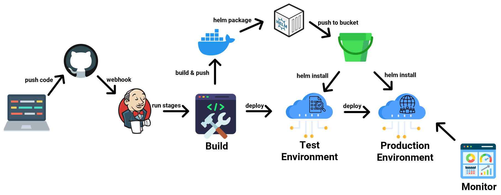

# Continuous Integration and Deployment Project

Welcome to the Continuous Integration and Deployment Project!  This project showcases the implementation of a modern CI/CD pipeline using industry-standard tools and practices. It focuses on streamlining the software development process, ensuring code quality, and automating deployment to various environments.

## Overview

In today's fast-paced software development landscape, CI/CD has become an essential practice. It involves automating the integration of code changes, running tests, and deploying updates efficiently and consistently. Our project employs the following key technologies:

- **Jenkins**: An automation server that orchestrates the CI/CD pipeline, from building and testing to deploying applications.
- **Docker**: A platform that enables packaging applications and their dependencies into lightweight, portable containers.
- **Kubernetes**: An open-source container orchestration platform that automates the deployment, scaling, and management of containerized applications.
- **Helm**: A package manager for Kubernetes that simplifies the deployment and management of applications.
- **Prometheus and Grafana**: Tools for monitoring and visualizing the health and performance of applications and infrastructure.
- **Terraform**: Infrastructure as Code (IaC) tool for managing cloud resources in a consistent and repeatable manner.

## How It Works

Our project provides a practical example of how these tools come together in a seamless workflow:

1. Developers make code changes and commit them to the version control repository.
2. Jenkins, our automation server, automatically kicks off a pipeline:
   - It builds a Docker image of the application, ensuring consistency across different environments.
   - Runs automated tests to validate code changes.
   - Approves changes for deployment based on predefined criteria.
   - Deploys the application to a Kubernetes cluster.
3. The application becomes accessible via a Load Balancer's public IP address.
4. Prometheus and Grafana provide real-time monitoring, helping ensure application health and performance.
5. The infrastructure can be managed as code using Terraform, enabling easy replication and scaling.

## Technical Details

For a detailed guide on how to set up and operate this CI/CD pipeline, please refer to the [Operational README](Assets/Operational-README.md). The operational README provides step-by-step instructions, prerequisites, and explanations for each component of the project.

## Contact

For any inquiries or further information about this project, please feel free to contact the project creator and maintainer at [razdahan31@gmail.com](mailto:razdahan31@gmail.com).
